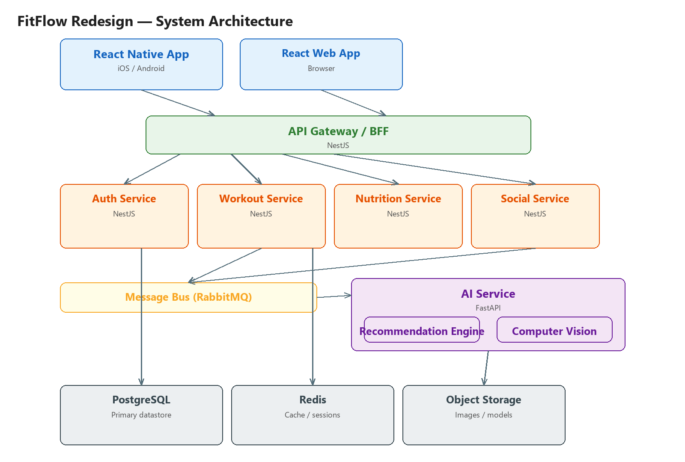

# FitFlow Redesign

FitFlow is a fitness platform for tracking workouts, nutrition, and social engagement. This repository contains the **redesigned** architecture, which decomposes the original application into a scalable, service-oriented system with a dedicated AI microservice.

## Overview

The redesign moves FitFlow from a monolithic application to a modular, containerized stack:

| Directory | Purpose |
|-----------|---------|
| `frontend/` | React Native app source (mobile + web) |
| `backend/` | Node.js / NestJS services (auth, workout, nutrition, social) |
| `ai-service/` | Python / FastAPI AI microservice (recommendation engine, computer vision) |
| `docs/` | Architecture & decision documentation |
| `scripts/` | Repository helper scripts (e.g. diagram generation) |
| `.github/workflows/` | CI/CD pipeline definitions |

## Architecture



> Editable source: [`docs/architecture-diagram.mmd`](docs/architecture-diagram.mmd)
> (Mermaid — renders natively on GitHub; regenerate the PNG with `python scripts/generate-architecture-diagram.py`.)

## Tech Stack (summary)

| Layer | Technology |
|-------|------------|
| Mobile | React Native (Expo) + TypeScript |
| Web | React (React Native Web) |
| Backend | Node.js + NestJS |
| AI | Python + FastAPI |
| Database | PostgreSQL |
| Cache | Redis |
| Message bus | RabbitMQ |
| CI/CD | GitHub Actions |

Full details and rationale: [`docs/tech-stack.md`](docs/tech-stack.md)

## Repository Structure

```
fitflow-redesign/
├── frontend/            # React Native app (mobile + web)
├── backend/             # Node.js/NestJS services (auth, workout, nutrition, social)
├── ai-service/          # Python/FastAPI AI microservice
├── docs/
│   ├── comparison-matrix.md
│   ├── architecture-diagram.png
│   ├── architecture-diagram.mmd
│   ├── ADR-001.md
│   └── tech-stack.md
├── scripts/             # helper scripts (diagram generation, etc.)
├── .github/workflows/   # CI/CD pipelines
├── README.md
├── .gitignore
└── LICENSE
```

## Getting Started

Each service is scaffolded independently and can be built/run in isolation.

```bash
# Frontend (React Native)
cd frontend
npm install
npm start

# Backend (NestJS)
cd backend
npm install
npm run start:dev

# AI service (FastAPI)
cd ai-service
pip install -r requirements.txt
uvicorn main:app --reload
```

## Documentation

- [Tech stack summary](docs/tech-stack.md)
- [Comparison matrix](docs/comparison-matrix.md)
- [ADR-001 — Service-oriented architecture](docs/ADR-001.md)
- [Architecture diagram](docs/architecture-diagram.png)

## CI/CD

Pipelines are defined in [`.github/workflows/ci.yml`](.github/workflows/ci.yml). Each job is
guarded so the workflow stays green even before a given service has code added.

## License

[MIT](LICENSE)
